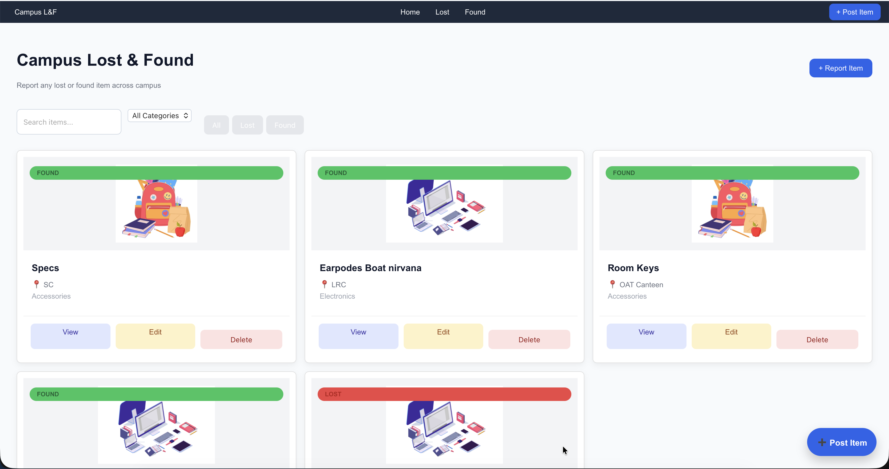
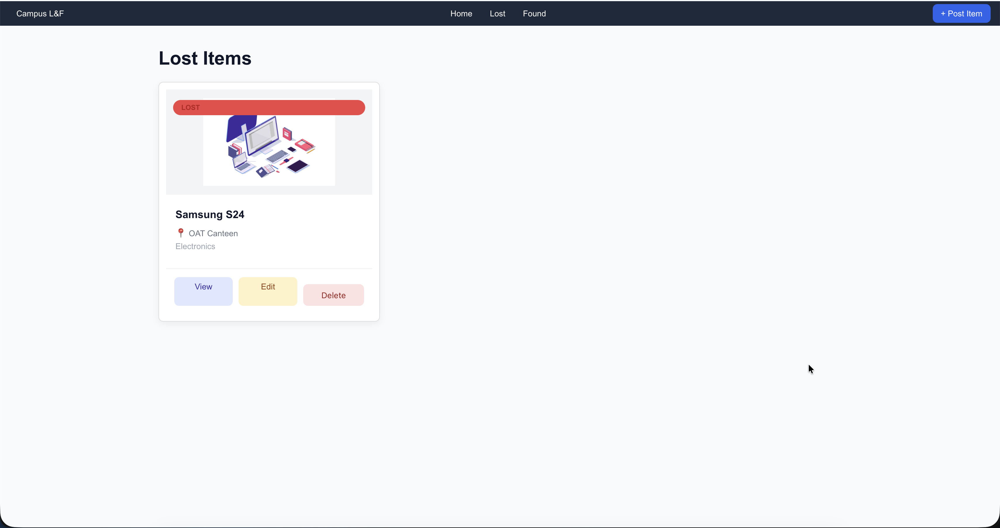
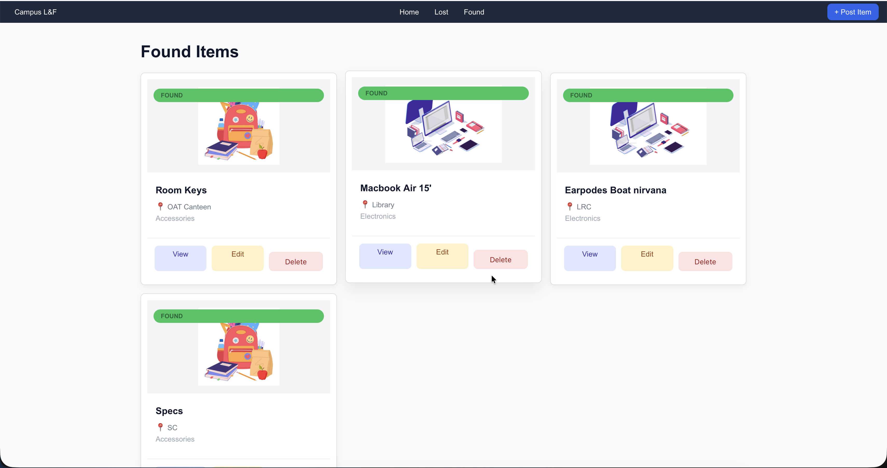
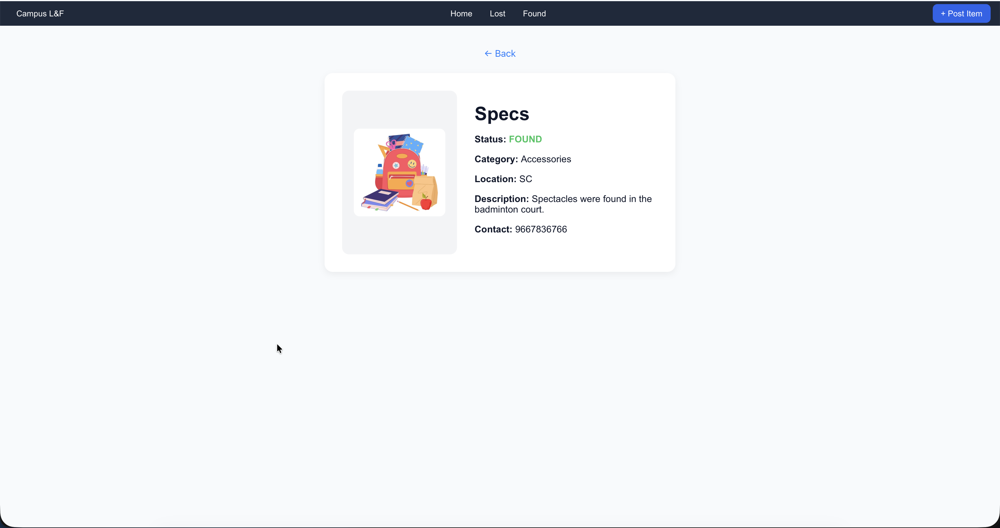
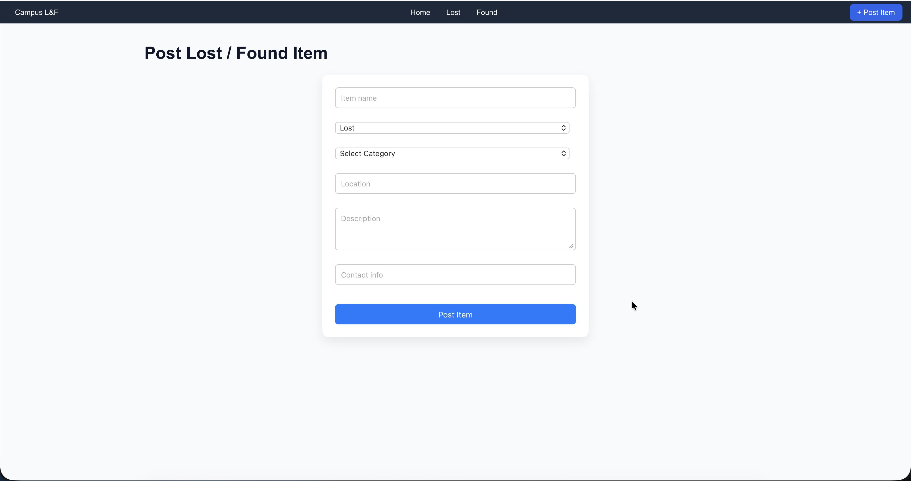

# Campus Lost & Found Portal

## Project Description
The **Campus Lost & Found Portal** is a web-based application designed to help students report, track, and recover lost items within the campus.  

Users can post details about **lost or found items**, browse existing listings, and view detailed information about each item. The platform aims to make the recovery process easier and more organized.

To simplify the system and avoid large storage requirements, the application automatically assigns **category-based images** (such as electronics, books, accessories, etc.) instead of requiring image uploads.

This project helps build a **community-driven lost and found system**, improving campus organization and increasing the chances of recovering lost belongings.

---

# Screenshots

## Homepage


## Lost Items Page


## Found Items Page


## Item Details Page

## Report Item Page



---

# Hosted URL

https://campus-lost-found-fawn.vercel.app/


---

# Features Implemented

## Frontend
- Responsive user interface
- Navigation using React Router
- Item listing cards
- View item details page
- Edit item functionality
- Delete item functionality
- Category-based automatic image assignment
- Status badges (Lost / Found)

## Backend
- Firebase Firestore database
- Store lost and found item records
- Create, read, update, and delete (CRUD) operations
- Real-time data updates

---

# Technologies / Libraries / Packages Used

### Frontend
- React.js
- React Router DOM
- CSS

### Backend / Database
- Firebase
- Firestore Database

### Tools
- Git
- GitHub
- VS Code

---

# Local Setup

Follow these steps to run the project locally:

### 1. Clone the repository

```bash
git clone https://github.com/your-username/your-repository-name.git

### 2. Navigate to the project directory
cd your-repository-name

### 3. Install dependencies
npm install

### 4. Configure Firebase
Create a firebase.js file and add your Firebase configuration


--- 
# Team Members

### Ravi Ratnakar
Roll no - 2025BCS-074


---

# Future Improvements

Image upload support using Firebase Storage
User authentication
Item claim request system
Admin dashboard
Advanced search and filters
Email notifications for matches
